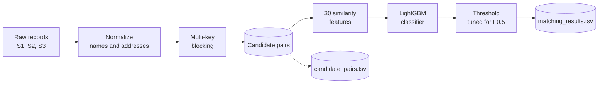

<div align="center">

# 🔗 Business Entity Resolution

**Matching the same business across three messy data sources**


*ML Challenge 2026*

</div>

---

## ✨ Overview

Business records arrive from independent sources with no shared identifiers, and the fields are noisy: abbreviations, legal-suffix differences, typos, transliterations, missing PIN codes, landmark-style addresses. This pipeline takes **Source 1** (the deduplicated reference) and finds every matching record in **Source 2** and **Source 3**.

A Source 1 entity can match zero, one, or many records in each other source, so correctly predicting *no match* matters just as much as finding matches.

## 🏆 Results

<div align="center">

| Metric | Score |
| :---: | :---: |
| **F₀.₅ (macro-averaged over Source 1 entities)** | **0.91** |

</div>

F₀.₅ weights precision twice as much as recall, since merging two different businesses is worse than missing a link. It is computed per Source 1 entity and then averaged, and singletons count: an empty prediction for a true singleton scores 1.0, any match predicted for it scores 0.0.

## 🧭 Pipeline



### 1. Blocking

Several complementary keys are combined so that a pair missed by one is usually caught by another. Blocks above 2000 records are pruned.

| Strategy | Purpose |
| :--- | :--- |
| Name-token inverted index | Every significant name token is a key, scoped by country |
| Soundex | Phonetic keys on significant tokens, for typos and spelling variants |
| Postal code | Country-agnostic key |
| Address numbers | Numbers with 3 or more digits used as keys |
| TF-IDF nearest neighbours | Character 3-4-grams, top 20 per country |

### 2. Features

<details>
<summary><b>30 features across name, address and cross-field signals</b></summary>

<br/>

**Name:** exact match, Levenshtein ratio, partial ratio, token sort ratio, token set ratio, Jaccard, containment (both directions), 3-gram Jaccard, prefix ratio, Soundex match, length ratio, first-token match, length difference

**Address:** Levenshtein ratio, token sort ratio, Jaccard, containment, numeric token Jaccard, numeric overlap count, postal exact / partial / presence, length ratio, empty flag

**Cross-field:** country match, name × address products, max name similarity

</details>

### 3. Model

A LightGBM binary classifier with 127 leaves and a learning rate of 0.03, trained for up to 1000 rounds with early stopping. `scale_pos_weight` handles the heavy class imbalance, and the decision threshold is tuned on a held-out validation set to maximise F₀.₅.

### 🌍 Unseen countries

Training data covers `US` and `India`, but the test set also contains `France`. Country is treated as an open set of string labels, with nothing hard-coded or one-hot encoded, so new countries go through the same pipeline.

## 🚀 Getting Started

```bash
pip install -r requirements.txt
```

Run everything from `code/business_entity_resolution/`:

```bash
# Full pipeline: train + test inference
python src/pipeline.py --mode full

# Quick dev run on a 5% sample
python src/pipeline.py --mode full --sample 0.05

# Train only
python src/pipeline.py --mode train

# Inference only (needs a trained model in models/)
python src/pipeline.py --mode test
```

A full run loads and normalises the training data, builds the blocking index, trains the classifier, tunes the threshold, then runs blocking and inference on the test set and writes both output files to `output/`.

## 📂 Project Structure

```
code/business_entity_resolution/
├── src/
│   ├── pipeline.py     # blocking, features, model, inference
│   ├── eda.py          # exploratory analysis
│   └── eda2.py         # matched-pair analysis
├── models/             # saved model artifacts (auto-created)
├── README.md
└── requirements.txt
```

## 📄 Data and Output

All files are **tab-separated**, so read them with `pd.read_csv(path, sep="\t")`.

**Input** (`dataset/train/` and `dataset/test/`): one file per source with `entity_id` (prefixed `S1-`, `S2-`, `S3-`), `business_name`, `business_address` and `country`, plus `train_ground_truth.tsv` for training labels.

**Output** (`output/`):

| File | Columns | Notes |
| :--- | :--- | :--- |
| `matching_results.tsv` | `source1_entity_id`, `matched_entity_ids` | Final matches; this is the scored file |
| `candidate_pairs.tsv` | `source1_entity_id`, `candidate_entity_ids` | Exactly what the model scored at inference |

Each Source 1 test entity has exactly one row, ID lists have no duplicates, and the final matches are always a subset of the candidates. Check both files before submitting:

```bash
python3 utils/validate_submission.py \
    --matching output/matching_results.tsv \
    --candidate output/candidate_pairs.tsv \
    --test-dir dataset/test
```

## ⚖️ Constraints

- No external data, APIs, geocoding or internet lookups. Only the provided training data is used.
- Only MIT / Apache-2.0 licensed models up to 8B parameters (LightGBM is MIT).

---

<div align="center">

Built by **mehta-aryan**

</div>
